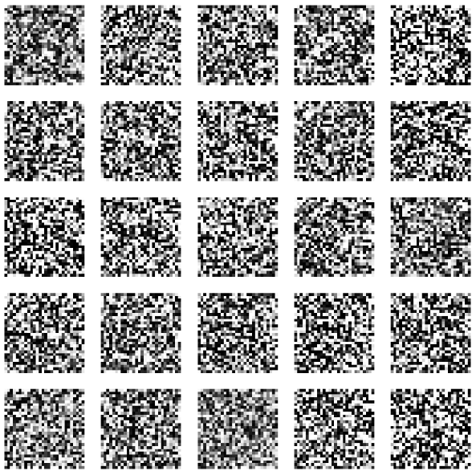

Develop GAN AI with TensorFlow
============================================================

This project implements a simple Generative Adversarial Network (GAN) using Tensorflow to generate images based on the MNIST dataset. The application allows users to trigger GAN training and generate synthetic images through HTTP requests.

## Features
- **Train a GAN**: Trigger GAN training via a Django view.
- **Generate Images**: Use a trained GAN to generate and display synthetic images.
- **MNIST Dataset**: The GAN is trained on the MNIST dataset of handwritten digits.

## Technologies Used
- **Django**: Web framework to manage HTTP requests and responses.
- **TensorFlow/Keras**: For building and training the GAN.
- **NumPy**: For data manipulation and preprocessing.
- **Matplotlib**: For visualizing generated images.

## Project Structure
```
project/
|-- gan_app/
|   |-- discriminator_builder.py # To build GAN's discriminator neural networks
|   |-- gan_model.py         # To build GAN model
|   |-- generate.py          # To generate image with trained GAN model
|   |-- generator_builder.py # To build GAN's generator neural networks
|   |-- train.py             # To train the GAN model
|   |-- urls.py              # URL configuration
|-- manage.py
|-- requirements.txt      # Required dependencies
|-- README.md             # Project documentation
```

## Installation

1. **Clone the repository**:
```bash
git clone <repo-url>
cd <repo-folder>
```

2. **Create and activate a virtual environment**:
```bash
python -m venv venv
source venv/bin/activate  # On Windows: venv\Scripts\activate
```

3. **Install dependencies**:
```bash
pip install -r requirements.txt
```

4. **Run Django migrations**:
```bash
python manage.py migrate
```

5. **Run the Django server**:
```bash
python manage.py runserver
```

## Usage

### Training the GAN
Send a GET request to the `/train/` endpoint to start training the GAN.
```bash
http://127.0.0.1:8000/train/
```

### Generating Images
Send a GET request to the `/generate/` endpoint to generate and visualize synthetic images.
```bash
http://127.0.0.1:8000/generate/
```

## How It Works

### Generator
- The generator model is built using fully connected layers and reshaped to generate 28x28 images.
- Batch normalization and Leaky ReLU activations help stabilize training.

### Discriminator
- The discriminator classifies real and fake images.
- It uses fully connected layers and a sigmoid activation to output a probability score.

### GAN Training
- The GAN is trained by alternating between training the discriminator and the generator.
- During each epoch, real images from the MNIST dataset and synthetic images generated by the generator are used to train the discriminator.

### Visualization
- The generated images are displayed using Matplotlib in a 5x5 grid.



## Endpoints
| Endpoint  | Method | Description                       |
|-----------|--------|-----------------------------------|
| /train/   | GET    | Triggers GAN training             |
| /generate/| GET    | Generates and displays images     |

## Requirements
- Python 3.8 or higher
- TensorFlow 2.x
- Django 4.x
- NumPy
- Matplotlib

Install dependencies with:
```bash
pip install tensorflow django numpy matplotlib
```

## Notes
- Training the GAN can take some time depending on system specifications.
- Make sure TensorFlow is properly installed and compatible with your hardware (GPU acceleration recommended).

## License
This project is licensed under the MIT License.

